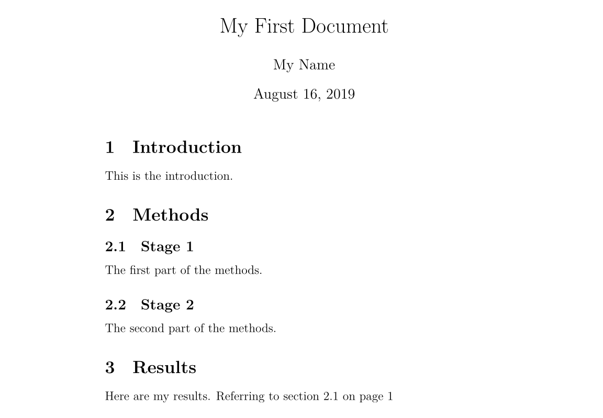

## Introduction

### What is LaTeX

LaTeX (pronounced as /ˈlɑːtɛx/ or /ˈleɪtɛx/) is a typesetting system that makes your documents look more professional, rather than a word processor. It is particularly suitable for handling long and structurally rigorous documents, and it is very good at dealing with mathematical expressions. It is free software and is applicable to most operating systems.

LaTeX is based on TeX (a typesetting system designed by Donald Knuth in 1978 for digital typesetting). TeX is a low-level language that computers can process, but most people find it difficult to use. LaTeX was designed to make it more user-friendly. The current version of LaTeX is LaTeX 2 e.

If you are accustomed to using Microsoft Office Word to handle documents, you will find the way LaTeX works very unfamiliar. Word is a typical "what you see is what you get" editor, where you can view the final typesetting effect while arranging the document. However, when using LaTeX, you cannot conveniently view the final effect, which makes you focus on the content rather than the adjustment of the appearance.

A LaTeX document is a text file ending with `.tex`, which can be edited with any text editor, such as Notepad, but for most people, using a suitable LaTeX editor will make the editing process much easier. During the editing process, you can mark the structure of the document. After completion, you can compile it - this means transforming it into a document of another format. It supports multiple formats, but the most commonly used is the PDF document format.

### Before You Begin

The following notation is used in this article:

- Operations you are expected to perform are marked with an arrow $\rightarrow$;
- Characters you enter are enclosed in code blocks;
- Menu commands and button names are marked in **bold**.

### Some Concepts

If you need to write a LaTeX document, you need to install a "distribution". Common distributions include [TeX Live](http://tug.org/texlive/), [MikTeX](https://miktex.org/), and MacTeX for macOS users (which is actually a macOS version of TeX Live), as for [CTeX](http://www.ctex.org/) it is not recommended for use now. TeX Live and MacTeX come with almost all LaTeX packages; while MikTeX only comes with a few necessary packages, and other packages will be installed when needed.

TeX Live and MikTeX both come with the TeXworks editor, and you can also install the more feature-rich TeXstudio editor, or configure editors like Visual Studio Code or Notepad++ yourself. The editor used in the following text is TeXworks running on Windows 7.

Most distributions come with multiple engines, such as pdfTeX and XeTeX. It is recommended to use XeTeX to get Unicode support if English is not your main language

TeX has multiple formats, such as Plain TeX and LaTeX. The LaTeX format is generally used now. So, you need to use the engine that comes with the format you are using. For example, for pdfTeX, you need to use pdfLaTeX, and for XeTeX, it is XeLaTeX.

Further reading (Chinese): [Introduction to TeX Engines, Formats, and Distributions](https://liam.page/2018/11/26/introduction-to-TeX-engine-format-and-distribution/).

### Environment Configuration

For Windows users, you need to download [TeX Live](https://tug.org/texlive/acquire-netinstall.html) or [MiKTeX](https://miktex.org/download). The installation package of TeX Live is an ISO file, which needs to be mounted as disk, then executed with administrator privileges `install-tl-advanced.bat`.

For macOS users, download [MacTeX](https://tug.org/mactex/mactex-download.html) and macOS version of [MiKTeX](https://miktex.org/download).

For Linux users, if using TeX Live, download the ISO file and execute the `install-tl` script; if using MikTeX, follow the [official documentation](https://miktex.org/download#unx) for installation.

## Document Structure

### Basic Elements

$\rightarrow$ Open TeXworks.

A new document will be opened automatically.

$\rightarrow$ Go to the **Format** menu and select **Line Numbers**.

Line numbers are not elements, but they can help you compare code with screen information and find errors.

$\rightarrow$ Go to the **Format** menu and select **Syntax Coloring**, then choose **LaTeX**.

Syntax coloring highlights the code, making it more readable.

$\rightarrow$ Enter the following text:

```tex
\documentclass[a4paper,12pt]{article}

\begin{document}

A sentence of text.

\end{document}
```

The `\documentclass` command must appear at the beginning of every LaTeX document. The text in the brackets specifies the type of document. The **article** document type is suitable for shorter articles, such as journal articles and short reports. Other document types include **report** (suitable for longer multi-chapter documents, such as doctoral dissertations), **proc** (conference proceedings), **book**, and **beamer**. The text in the square brackets specifies some options - in the example, it sets the paper size to A 4 and the main text size to 12 pt.

The `\begin{document}` and `\end{document}` commands wrap your text content. Any text before `\begin{document}` is considered a preamble and will affect the entire document. Any text after `\end{document}` will be ignored.

Blank lines are not necessary, but they can make long documents more readable.

$\rightarrow$ Press the **Save** button; $\rightarrow$ Create a new folder named **LaTeX course** in **Libraries>Documents**; $\rightarrow$ Name your document **Doc 1** and save it as a **TeX document** in this folder.

It is a good idea to put different LaTeX documents in different directories, and combine multiple files when compiling.

$\rightarrow$ Make sure the typeset menu is set to **xeLaTeX**. $\rightarrow$ Click the **Typeset** button.

At this point, your source file will be converted into a PDF document, which will take some time. After the compilation is finished, the TeXworks PDF viewer will open and preview the generated file. The PDF file will be saved automatically in the same directory as the TeX document.

### Handling Problems

If there are errors in your document and TeXworks cannot create a PDF document, the **Typeset** button will turn into a red cross, and the terminal output at the bottom will remain expanded. At this time:

$\rightarrow$ Click the **Abort typesetting** button. $\rightarrow$ Read the content of the terminal output, the last line may give the line number indicating the location of the error. $\rightarrow$ Find the corresponding line in the document and fix the error. $\rightarrow$ Click the **Typeset** button again to try to compile the source file.

### Adding Document Title

The `\maketitle` command can create a title for the document. You need to specify the title of the document. If no date is specified, the current time will be used, and the author is optional.

$\rightarrow$ Enter the following text immediately after the `\begin{document}` command:

```tex
\title{My First Document}
\author{My Name}
\date{\today}
\maketitle
```

Your document now looks like this:

```tex
\documentclass[a4paper,12pt]{article}

\begin{document}

\title{My First Document}
\author{My Name}
\date{\today}
\maketitle

A sentence of text.

\end{document}
```

$\rightarrow$ Click the **Typeset** button and check the generated PDF document.

Key notes:

- `\today` is the command to insert the current time. You can also enter a different time, such as `\data{November 2013}`.
- The text of the **article** document will be typeset on the same page immediately after the title. **report** will put the title on a separate page.

### Sections

If necessary, you may want to divide your document into chapters (Chatpers), sections (Sections), and subsections (Subsections). The following sectioning commands are suitable for **article** type documents:

- `\section{...}`
- `\subsection{...}`
- `\subsubsection{...}`
- `\paragraph{...}`
- `\subparagraph{...}`

The text in the brackets represents the title of the section. For **report** and **book** type documents, we also support the `\chapter{...}` command.

$\rightarrow$ Replace "A sentence of text." with the following text:

```tex
\section{Introduction}
This is the introduction.

\section{Methods}

\subsection{Stage 1}
The first part of the methods.

\subsection{Stage 2}
The second part of the methods.

\section{Results}
Here are my results.
```

Your document becomes

```tex
\documentclass[a4paper,12pt]{article}

\begin{document}

\title{My First Document}
\author{My Name}
\date{\today}
\maketitle

\section{Introduction}
This is the introduction.

\section{Methods}

\subsection{Stage 1}
The first part of the methods.

\subsection{Stage 2}
The second part of the methods.

\section{Results}
Here are my results.

\end{document}
```

$\rightarrow$ Click the **Typeset** button and check the PDF document. It should look like this:


### Creating Labels

You can create labels for any sectioning commands so that they can be referenced elsewhere in the document. Use `\label{labelname}` to create a label for a section. Then enter `\ref{labelname}` or `\pageref{labelname}` to reference the corresponding section.

$\rightarrow$ On a new line below `\subsection{Stage 1}`, enter `\label{sec1}`. $\rightarrow$ In the **Results** section, enter `Referring to section \ref{sec1} on page \pageref{sec1}`.

Your document will now look like this:

```tex
\documentclass[a4paper,12pt]{article}

\begin{document}

\title{My First Document}
\author{My Name}
\date{\today}
\maketitle

\section{Introduction}
This is the introduction.

\section{Methods}

\subsection{Stage 1}
\label{sec1}
The first part of the methods.

\subsection{Stage 2}
The second part of the methods.

\section{Results}
Here are my results. Referring to section \ref{sec1} on page \pageref{sec1}

\end{document}
```

$\rightarrow$ Compile and check the PDF document (you may need to compile twice consecutively):



### Generating a Table of Contents (TOC)

If you use sectioning commands, you can easily generate a table of contents. Use `\tableofcontents` to create a table of contents in the document. We usually place the table of contents right after the title.

You may also want to change the page numbering to Roman numerals (i, ii, iii). This ensures that the main text of the document starts on page 1. Page numbering can be switched between Arabic and Roman numerals using the `\pagenumbering{...}` command.

$\rightarrow$ Enter the following content after `\maketitle`:

```tex
\pagenumbering{roman}
\tableofcontents
\newpage
\pagenumbering{arabic}
```

The `\newpage` command starts a new page, so we can see the effect of the `\pagenumbering` command. The first 14 lines of your document look like this:

```tex
\documentclass[a4paper,12pt]{article}

\begin{document}

\title{My First Document}
\author{My Name}
\date{\today}
\maketitle

\pagenumbering{roman}
\tableofcontents
\newpage
\pagenumbering{arabic}
```

$\rightarrow$ Compile and check the document (multiple compilations may be required, not mentioned below).

The first page of the document looks like this:


The second page:


## Text Processing

### Support for Chinese Fonts

Those who read this article to learn LaTeX should naturally learn how to support Chinese fonts in LaTeX first. In fact, there are many ways to support Chinese fonts in LaTeX. Here we only give the most **concise** solution: use the CTeX package. Just add the following to the preamble of the document:

```tex
\usepackage[UTF8]{ctex}
```

That's it. Use the `xelatex` command when compiling the document because it supports Chinese fonts.

### Font Effects

LaTeX has a variety of font effects, listed here are a few:

```tex
\textit{words in italics}
\textsl{words slanted}
\textsc{words in smallcaps}
\textbf{words in bold}
\texttt{words in teletype}
\textsf{sans serif words}
\textrm{roman words}
\underline{underlined words}
```

The effects are as follows:


$\rightarrow$ Add more text to your document and try various font effects.

### Colored Fonts

To support colored fonts in your document, you need to use packages. You can cite many packages to enhance the typesetting effect of LaTeX. The command to cite a package is placed in the preamble of the document (i.e., before the `\begin{document}` command). Use `\usepackage[options]{package}` to cite a package. Where **package** is the name of the package, and **options** are some parameters that specify the features of the package.

After using `\usepackage{color}`, we can call common colors:


The code for colored fonts is

```tex
{\color{colorname}text}
```

Where **colorname** is the name of the color you want, and **text** is your colored text content. Note that in the example effect, yellow and white have text background colors, which can also be achieved using the `\colorbox` command in the Color package. The usage is as follows:

```tex
\colorbox{colorname}{text}
```

$\rightarrow$ Enter `\usepackage{color}` before `\begin{document}`. $\rightarrow$ Enter `{\color{red}fire}` in the document content. $\rightarrow$ Compile and check the PDF document content.

The word fire should be red.

You can also add some parameters to call more colors, even customize the colors you need. But this part is beyond the content of this book. If you want to get more content about colored text, please read the [Colors section](http://en.wikibooks.org/wiki/LaTeX/Colors) of LaTeX Wikibook.

### Font Size

Next, we list some font size setting commands in LaTeX:

```tex
normal size words
{\tiny tiny words}
{\scriptsize scriptsize words}
{\footnotesize footnotesize words}
{\small small words}
{\large large words}
{\Large Large words}
{\LARGE LARGE words}
{\huge huge words}
```

The effects are as follows:


$\rightarrow$ Try to adjust the font size for your text.

### Paragraph Indentation

LaTeX defaults to having the first line of each section not indented, and the first line of subsequent paragraphs indented. If you want the paragraphs not to indent, add the `\noindent` command before the paragraph you want to be not indented. If you want all paragraphs to not indent globally, use the `\setlength{\parindent}{0pt}` command at some point in the document, and all subsequent paragraphs will not indent.

### Lists

LaTeX supports two types of lists: ordered lists (enumerate) and unordered lists (itemize). The elements in the lists are defined as `\item`. Lists can have sublists.

$\rightarrow$ Enter the following content to generate an ordered list with an unordered list:

```tex
\begin{enumerate}
\item First thing
\item Second thing
\begin{itemize}
\item A sub-thing
\item Another sub-thing
\end{itemize}
\item Third thing
\end{enumerate}
```

$\rightarrow$ Compile and check the PDF document.

The list looks like this:


You can use square bracket parameters to modify the symbol for unordered list items. For example, `\item[-]` will use a dash as the symbol, and you can even use a word, such as `\item[One]`.

The following code:

```tex
\begin{itemize}
\item[-] First thing
\item[+] Second thing
\begin{itemize}
\item[Fish] A sub-thing
\item[Plants] Another sub-thing
\end{itemize}
\item[Q] Third thing
\end{itemize}
```

Generates the effect of


### Comments and Spaces

We use % to create a single-line comment; the content after this character on the same line will be ignored until the next line begins.

The following code:

```tex
It is a truth universally acknowledged% Note comic irony
in the very first sentence
, that a single man in possession of a good fortune, must
be in want of a wife.
```

Generates the result as


Multiple consecutive spaces in LaTeX are considered as one space. Multiple consecutive blank lines are considered as one blank line. The main function of a blank line is to start a new paragraph. Generally, LaTeX ignores blank lines and other whitespace characters; two backslashes (`\\`) can be used to break lines.

$\rightarrow$ Try adding comments and blank lines in your document.

If you want to add spaces in your document, you can use the command `\vspace{...}`. This allows you to add vertical space, the height of which can be specified. For example, `\vspace{12pt}` creates a space equal to the height of a 12 pt font.

### Special Characters

The following characters are special characters in LaTeX:

```text
# $ % ^ & _ { } ~ \
```

To use these characters, we need to add a backslash in front of them to escape:

```tex
\# \$ \% \^{} \& \_ \{ \} \~{}
```

Note that when using the `^` and `~` characters, a pair of closing curly braces must follow immediately; otherwise, they will be interpreted as superscripts, just like `\^ e` becomes $\mathrm {\hat{e}}$. The effect of the above code is as follows:


Note that the backslash cannot be escaped by a backslash (otherwise it becomes a line break), use the `\textbackslash` command instead.

$\rightarrow$ Enter the code to generate the following content in your document:


Consult an expert or check the TeX source code of this book for help.

## Tables

The tabular command is used for typesetting tables. LaTeX tables do not have horizontal and vertical lines by default—if you need them, you must set them manually. LaTeX automatically sets the width of the table based on the content. The following code can create a table:

```tex
\begin{tabular}{...}
```

The ellipsis is replaced by the code defining the columns of the table:

- `l` denotes a left-aligned column;
- `r` denotes a right-aligned column;
- `c` denotes a center-aligned column;
- `|` denotes a vertical line for a column;

For example, `{lll}` creates a three-column table with left alignment and no explicit vertical lines; `{|l|l|r|}` creates a three-column table with the first two columns left-aligned, the last column right-aligned, and explicit vertical lines between adjacent columns.

Table data is entered after `\begin{tabular}`:

- `&` is used to separate columns;
- `\\` is used for a new line;
- `\hline` indicates the insertion of a horizontal line across all columns;
- `\cline{1-2}` inserts a horizontal line in the first and second columns.

Finally, end the table with `\end{tabular}`. Here are some examples:

```tex
\begin{tabular}{|l|l|}
Apples & Green \\
Strawberries & Red \\
Orange & Orange\\
\end{tabular}

\begin{tabular}{rc}
Apples & Green\\
\hline 
Strawberries & Red \\
\cline{1-1}
Oranges & Orange \\
\end{tabular}

\begin{tabular}{|r|l|}
\hline
8 & here's \\
\cline{2-2}
86 & stuff\\
\hline \hline 
2008 & now \\
\hline 
\end{tabular}
```

The effects are as follows:


### Practice

Try to draw the following table:


## Figures

This section introduces how to insert figures into LaTeX documents. Here we need to introduce the **graphicx** package. Images should be in PDF, PNG, JPEG, or GIF format. The following code will insert an image named myimage:

```tex
\begin{figure}[h]
\centering
\includegraphics[width=1\textwidth]{myimage}
\caption{Here is my image}
\label{image-myimage}
\end{figure}
```

`[h]` is a placement parameter, **h** means to place the figure approximately here (if it fits). There are other options: **t** means to place it at the top of the page; **b** means to place it at the bottom of the page; **p** means to start a new page for the figure. You can also add a **!** parameter to force placement at the specified location (although this may result in poor typesetting).

`\centering` centers the image on the page. Without this command, the default alignment is to the left. Using it works well because the figure's caption is also centered.

`\includegraphics{...}` command can automatically place the image into your document, and the image file should be in the same directory as the TeX file.

`[width=1\textwidth]` is an optional parameter that specifies the width of the image—the same as the width of the text. The width can also be in centimeters. You can also use `[scale=0.5]` to reduce the image proportionally (the example is equivalent to reducing by half).

`\caption{...}` defines the title of the figure. If used, LaTeX will add a number starting with "Figure" to your figure. You can use `\listoffigures` to generate a catalog of figures.

`\label{...}` creates a label that you can refer to.

### Practice

$\rightarrow$ Add `\usepackage{graphicx}` in the preamble of your document. $\rightarrow$ Find an image and place it in your **LaTeX course** folder. $\rightarrow$ Enter the following content where you want to add an image:

```tex
\begin{figure}[h!]
\centering
\includegraphics[width=1\textwidth]{ImageFilename}
\caption{My test image}
\end{figure}
```

Replace **ImageFilename** with the name of your file (excluding the suffix). If your file name has spaces, enclose it in double quotes, such as `"screen 20"`.

$\rightarrow$ Compile and check the file.

## Equations

One of the main reasons to use LaTeX is that it can easily typeset equations. We use math mode to typeset equations.

### Inserting Equations

You can use a pair of `$` to enable math mode, which can be used for writing inline mathematical formulas. For example, `$1+2=3$` produces the effect of $1+2=3$.

If you want a formula in the line, you can use `$$...$$` (now we recommend using `\[...\]`, because the former may produce poor spacing). For example, `$$1+2=3$$` produces the effect of

$$
1+2=3
$$

If you are generating a numbered formula, you can use `\begin{equation}...\end{equation}`. For example, `\begin{equation}1+2=3\end{equation}` produces the effect of:

$$
\begin{equation}1+2=3\end{equation}
$$

The number 6 represents the chapter number, which only appears when your document has set chapters, such as documents of type **report**.

Use `\begin{eqnarray}...\end{eqnarray}` to write a set of numbered formulas. For example:

```tex
\begin{eqnarray}
A & = & b + c \\
  & = & y - z
\end{eqnarray}
```

Produces the effect of

$$
\begin{eqnarray}
A & = & b + c \\
  & = & y - z
\end{eqnarray}
$$

To write unnumbered formulas, just add an asterisk character after the environment flag, such as `{equation*}`, `{eqnarray*}`.

### Mathematical Symbols

Although some basic symbols can be typed directly, most special symbols need to be displayed using commands.

This book is only an introductory tutorial for the use of mathematical symbols. The mathematical symbols section of LaTeX Wikibook is another better and more complete tutorial. If you want to learn more about mathematical symbols, please move on. If you want to find a specific symbol, you can use [Detexfiy](http://detexify.kirelabs.org), which can recognize handwritten characters.

#### Superscripts and Subscripts

Superscripts (Powers) are represented by `^`, for example, `$n^2$` produces the effect of $n^2$.

Subscripts (Indices) are represented by `_`, for example, `$2_a$` produces the effect of $2_a$.

If the content of the superscript or subscript contains multiple characters, please enclose them in curly braces. For example, `$b_{a-2}$` has the effect of $b_{a-2}$.

#### Fractions

Fractions are inserted using the `\frac{numerator}{denominator}` command. For example, `$$\frac{a}{3}$$` produces the effect of

$$
\frac{a}{3}
$$

Fractions can be nested. For example, `$$\frac{y}{\frac{3}{x}+b}$$` produces the effect of

$$
\frac{y}{\frac{3}{x}+b}
$$

#### Square Roots

We use the `\sqrt{...}` command to insert square roots. The content of the ellipsis is replaced by the content under the root. If you need to add the degree of the root, enclose it in square brackets.

For example, `$$\sqrt{y^2}$$` produces the effect of

$$
\sqrt{y^2}
$$

While `$$\sqrt[x]{y^2}$$` produces the effect of

$$
\sqrt[x]{y^2}
$$

#### Summation and Integrals

Use `\sum` and `\int` to insert summation and integral signs. For both symbols, the upper limit is represented by `^` and the lower limit by `_`.

`$$\sum_{x=1}^5 y^z$$` produces the effect of

$$
\sum_{x=1}^5 y^z
$$

While `$$\int_a^b f(x)$$` produces the effect of

$$
\int_a^b f(x)
$$

#### Greek Letters

We can represent a Greek letter by using a backslash followed by the name of the Greek letter. The case of the first letter of the name determines the form of the Greek letter. For example:

- `$\alpha$` = $\alpha$
- `$\beta$` = $\beta$
- `$\delta, \Delta$` = $\delta, \Delta$
- `$\pi, \Pi$` = $\pi, \Pi$
- `$\sigma, \Sigma$` = $\sigma, \Sigma$
- `$\phi, \Phi, \varphi$` = $\phi, \Phi, \varphi$
- `$\psi, \Psi$` = $\psi, \Psi$
- `$\omega, \Omega$` = $\omega, \Omega$

### Practice

$\rightarrow$ Write code to generate the following formula:


If you need help, you can check the TeX source code of this book.

## References

### Introduction

LaTeX can easily insert references and a table of contents. This article will introduce how to use another BibTeX file to store references.

### BibTeX File Types

BibTeX files contain all the literature you want to cite in your document. Its file suffix is `.bib`. Its name should be set to the name of your TeX document. `.bib` files are text files. You need to input your references in the following format:

```text
@article{
    Birdetal2001,
    Author = {Bird, R. B. and Smith, E. A. and Bird, D. W.},
    Title = {The hunting handicap: costly signaling in human foraging strategies},
    Journal = {Behavioral Ecology and Sociobiology},
    Volume = {50},
    Pages = {9-19},
    Year = {2001} 
}
```

Each reference first declares its reference type. The example uses @article; other types include @book, @incollection for citing a chapter in a book, and @inproceedings for citing conference papers. You can see more supported types [here](http://en.wikibooks.org/wiki/LaTeX/Bibliography_Management).

Next, within the curly braces, first list a citation key. You must ensure that the citation keys for your references are different. You can customize the key, but using the first author's name plus the year is a semantically clear choice.

The following lines include several pieces of information about the literature, in the format:

```text
Field name = {field contents},
```

You can use LaTeX commands to generate special text effects. For example, italics can be used with `\emph{Rattus norvegicus}`.

For letters that need to be capitalized, enclose them in curly braces. BibTeX will automatically replace all uppercase letters in the title except the first letter with lowercase. For example, `Dispersal in the contemporary United States` will produce $\text{Dispersal in the contemporary united states}$, while `Dispersal in the contemporary {U}nited {S}tates` will produce $\text{Dispersal in the contemporary United States}$.

You can handwrite BibTeX files or use software to generate them.

### Inserting the Bibliography

Use the following commands to insert the bibliography at the current position in the document:

```tex
\bibliographystyle{plain}
\bibliography{references}
```

References are written in `references.bib`.

### Citing References

Use `\cite{citationkey}` to insert a citation at the place where you want to reference a literature. If you do not want to insert a reference in the text but still want it to appear in the bibliography, use the `\nocite{citationkey}` command.

To insert page number information in the citation, use brackets: `\cite[p. 215]{citationkey}`.

To cite multiple references, separate them with commas: `\cite{citation01,citation02,citation03}`.

### Citation Styles

#### Numerical Citations

LaTeX includes several formats for in-text numerical citations:

**Plain** Encloses numbers in brackets, such as $[1]$. The bibliography list is sorted alphabetically by the first author's name. Each author's name is in full.

**Abbrv** Is the same as **plain**, but the author's name is abbreviated.

**Unsrt** Is the same as **plain**, but the bibliography list is sorted in the order of citation in the text.

**Alpha** Is like **plain**, but the citation label is a combination of the author's name and year, not a number, such as $[Kop10]$.

#### Author-Date Citations

If you want to use author-date citations, use the **natbib** package. It uses the `\citep{...}` command to generate a bracketed citation, such as $[Koppe,2010]$, and uses `\citet{...}` to generate a citation that puts the year in brackets only, such as $Koppe [2010]$. [See here](http://mirror.ctan.org/macros/latex/contrib/natbib/natnotes.pdf) for more usage.

The Natbib package also has three styles: **plainnat**, **abbrvnat**, and **unsrtnat**, which have the same effects as **plain**, **abbrv**, and **unsrt**, respectively.

#### Other Citation Formats

If you need to use a different format, you need to create a style file (`.bst` file) in the same folder. When referencing this format, use its file name to call the `\bibliographystyle{...}` command to implement it.

### Practice

$\rightarrow$ Create a 同名 BibTeX file in the same folder and enter the reference information in the correct format. $\rightarrow$ Switch to the TeX document and use the `\cite`, `\bibliographystyle`, and `\bibliography` commands to cite references. $\rightarrow$ Compile the TeX file. $\rightarrow$ Switch to the BibTeX file and compile (click the **Typeset** button) $\rightarrow$ Switch back to the TeX file and compile it **twice**, then check the PDF document.

## Further Reading

The Not So Short Introduction to LaTeX <https://tobi.oetiker.ch/lshort/lshort.pdf> Or LATEX in 280 minutes.

LaTeX Project <http://www.latex-project.org/> Official website - has links to documentation, information about installing LaTeX on your own computer, and information about where to look for help.

LaTeX Wikibook <http://en.wikibooks.org/wiki/LaTeX/> Comprehensive and clearly written, although still a work in progress. A downloadable PDF is also available.

Comparison of TeX Editors on Wikipedia <http://en.wikipedia.org/wiki/Comparison_of_TeX_editors> Information to help you choose which LaTeX editor to install on your own computer.

TeX Live <http://www.tug.org/texlive/>“An easy way to get up and running with the TeX document production system”. Available for Unix and Windows (links to MacTeX for MacOSX users). Includes the TeXworks editor.

Workbook Source Files <http://edin.ac/17EQPM1> Download the .tex file and other files needed to compile this workbook.

**This article is modificated on <http://www.docs.is.ed.ac.uk/skills/documents/3722/3722-2014.pdf>**, and some other documents.
